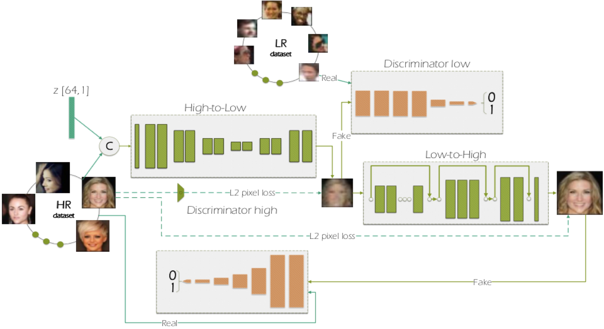

# Face and Image Super-resolution
## Paper
Adrian Bulat*, Jing Yang*, Georgios Tzimiropoulos
''To learn image super-resolution, use a GAN to learn how to do image degradation first'' in ECCV2018

## Method
<div align="center">
     
</div> 

   * High-to-Low GAN using unpaired low and high-resolution images to simulate the image degradation 
   * Low-to-High GAN using paired low and high-resolution images to learn real-world super resolution
   * GAN loss driving the image generation process

## Requirements
```
Pytorch 0.4.1
```
## Data
* Trainset is in Dataset. HIGH is the training high resolution images. LOW is the training low resolution images 
* Testset is testset.tar
* test_res.tar is our result


## Running testing
```
CUDA_VISIBLE_DEVICES=0, python model_evaluation.py 
```
## Fid Calculation
```
CUDA_VISIBLE_DEVICES=0, python fid_score.py /Dataset/HIGH/SRtrainset_2/ test_res/
```
This code is from https://github.com/mseitzer/pytorch-fid


## Citation
```
@inproceedings{bulat2018learn, 
  title={To learn image super-resolution, use a GAN to learn how to do image degradation first},
  author={Bulat, Adrian and Yang, Jing and Tzimiropoulos, Georgios},
  booktitle={Proceedings of the European Conference on Computer Vision (ECCV)},
  pages={185--200},
  year={2018}  
}
```

## License

This project is licensed under the MIT License
